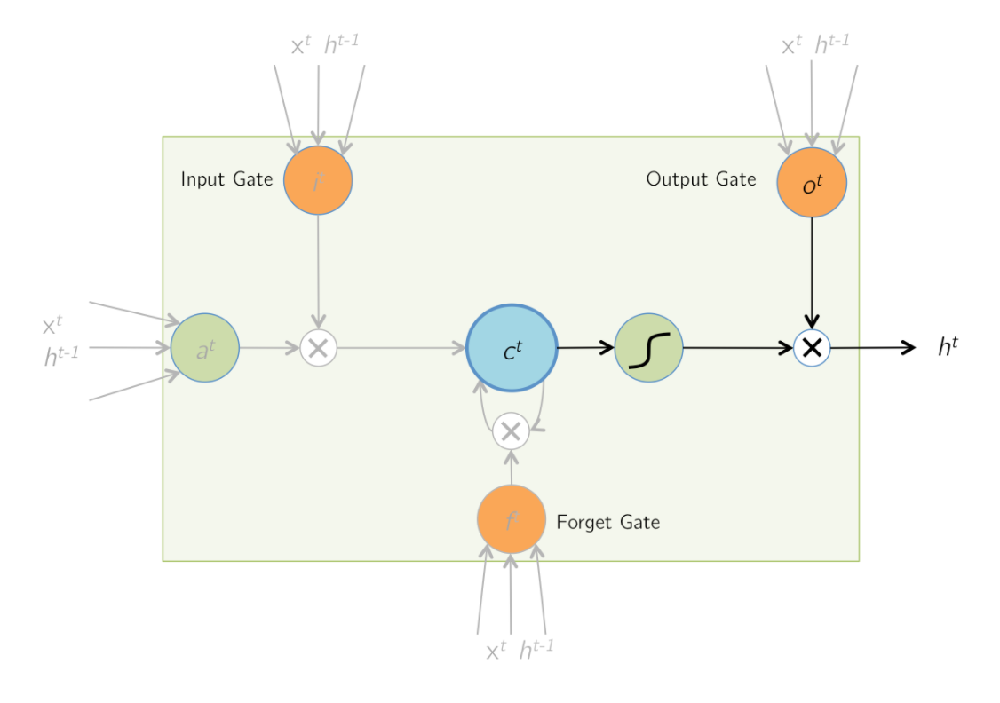

# LSTM

Many readers started learning LSTM from [this blog post](http://colah.github.io/posts/2015-08-Understanding-LSTMs/).  But for those who want to dive deeper into its math derivations, [this slide](http://arunmallya.github.io/writeups/nn/lstm/index.html#/) is a better choice.

## The LSTM Unit

# Forward Pass

1. an input: $a^t = \tanh(\hat a^t) = \tanh(W_a x^t + U_a h^{t-1})$
3. the input gate: $i^t = \sigma( \hat i_t) = \sigma(W_i x^t + U_i h^{t-1})$
3. the forget gate: $f^t = \sigma(\hat f^t) = \sigma(W_f x^t + U_f h^{t-1})$
4. the memory cell: $c^t = a^t \odot i^t + c^{t-1} \odot f^t$
2. the output gate: $o^t = \sigma(\hat o^t) = \sigma(W_o x^t + U_o h^{t-1})$
4. the output: $h^t = \tanh(c^t) \odot o^t$

**NOTE:**

1. There is am implicit dataflow $c^{t+1} = c^t$ between LSTM units.  This implies that $c^t$ should accept gradients from *not only $h^t$, but also $h^{t+1}$*.

1. All gates uses the sigmoid function as their activations.  This is because the gates' output must be in the range $[0,1]$ so could they be used with $\odot$ as the gate.

1. The non-linearity of an LSTM cell comes from the $\tanh$ activations of $a^t$ and $h_t$.  Compared with sigmoid, whose gradient closes to zero when the input is very negative and stucks the SGD process, $\tanh$ doesn't have this problem.

## Backward Pass

The backward pass updates $W_o$, $U_o$, $W_f$, $U_f$, $W_i$, and $U_i$.

Denoting the error of $h^t$ by $E$, the derivation of the [backpropagation algorithm](./Derivatives-of-Activations.md) tells that we will have $\frac{\partial E}{\partial h^t}$ form the cost layer. 

$$\frac{\partial E}{\partial o^t} 
= \frac{\partial E}{\partial h^t} \cdot \frac{\partial h^t}{\partial o^t} 
= \frac{\partial E}{\partial h^t} \odot \tanh(c^t) $$

$$\frac{\partial E}{\partial c^t} 
= \frac{\partial E}{\partial h^t} \frac{\partial h^t}{\partial c^t} 
= \frac{\partial E}{\partial h^t} \odot o^t \odot \left[ 1 - \tanh^2(c^t) \right] $$

Due to the implicit dataflow, we introduce a varaible $\delta c^t$ to accumulate gradients from $h^T$:

$$ \delta c^t += \frac{\partial E}{\partial c^t} $$

Given $\delta c^t$, we can find 

$$\frac{\partial E}{\partial i^t} = \delta c^t \odot a^t $$
$$\frac{\partial E}{\partial a^t} = \delta c^t \odot i^t $$
$$\frac{\partial E}{\partial f^t} = \delta c^t \odot c^{t-1} $$
$$\frac{\partial E}{\partial c^{t-1}} = \delta c^t \odot f^t $$

**NOTE:** that *the last equation sets the initial value of $\delta c^{t-1}$, which will be updated later by $\frac{\partial E}{\partial c^{t-1}}$*.

$$ \frac{\partial E}{\partial \hat{a}^t} 
= \frac{\partial E}{\partial a^t} \odot \left[ 1- \tanh(\hat a^t) \right] $$

$$ \frac{\partial E}{\partial \hat{i}^t} 
= \frac{\partial E}{\partial i^t} \odot \hat a^t \odot (1- \hat a^t) $$

$$ \frac{\partial E}{\partial \hat f^t}
= \frac{\partial E}{\partial f^t} \odot \hat f^t \odot (1- \hat f^t) $$

$$ \frac{\partial E}{\partial \hat o^t}
= \frac{\partial E}{\partial o^t} \odot \hat o^t \odot (1- \hat o^t) $$

Because

$$ \hat I = \Theta I $$

where

$$ \hat I^t = [\hat a^t \; \hat i^t \; \hat f^t \; \hat o^t]^T $$
$$ \Theta = [W \; U] $$
$$ I^t = [x^t \; h^{t-1}]^T $$

we have

$$ \delta \Theta^t 
= \frac{\partial E}{\partial \Theta} \mid_t 
= \frac{\partial E}{\partial \hat I^t} \cdot \frac{\partial\hat I^t}{\partial\Theta} \mid_t
= \left[
 \frac{\partial E}{\partial \hat a^t} \;
 \frac{\partial E}{\partial \hat i^t} \;
 \frac{\partial E}{\partial \hat f^t} \;
 \frac{\partial E}{\partial \hat o^t} \right] \times I^t $$
 
According to the multivariate chain rule

$$ \frac{\partial E}{\partial \Theta} = \sum_{t=1}^T \delta \Theta^t $$